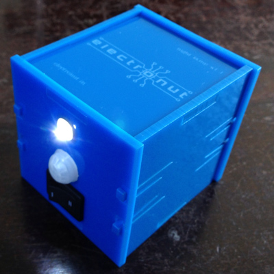

A 555 based motion sensing night lamp kit for kids. You can read about the project here:

http://electronut.in/night-lamp/

 Motion Sensing Night Lamp Kit by <a xmlns:cc="http://creativecommons.org/ns#" href="electronut.in" property="cc:attributionName" rel="cc:attributionURL">Mahesh Venkitachalam</a> is licensed under a <a rel="license" href="http://creativecommons.org/licenses/by-sa/4.0/">Creative Commons Attribution-ShareAlike 4.0 International License</a>.