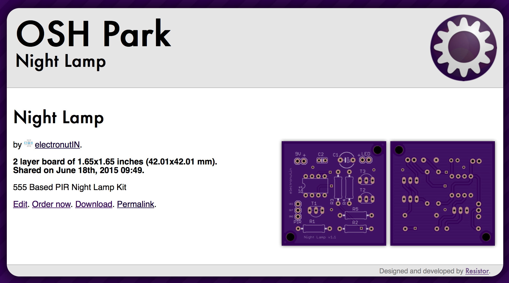

### Project

A 555 based motion sensing night lamp kit for kids. You can read about the project here:

http://electronut.in/night-lamp/

### Schematic

Here is the schematic:

### PCB

You can order the PCB from the OSH Park link below:

https://oshpark.com/shared_projects/wEVw0g1x

### License

 Motion Sensing Night Lamp Kit by <a xmlns:cc="http://creativecommons.org/ns#" href="electronut.in" property="cc:attributionName" rel="cc:attributionURL">Mahesh Venkitachalam</a> is licensed under a <a rel="license" href="http://creativecommons.org/licenses/by-sa/4.0/">Creative Commons Attribution-ShareAlike 4.0 International License</a>.